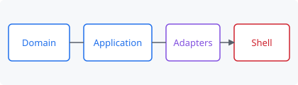

# Markdown Preview Handler

**Rich Markdown previews inside the Windows File Explorer preview pane** — syntax
highlighting, Mermaid diagrams, LaTeX math, and automatic light/dark theming.

[](LICENSE)
[](https://dotnet.microsoft.com/download/dotnet/8.0)
[](#requirements)
[](https://developer.microsoft.com/microsoft-edge/webview2/)

Select a `.md` file, press `Alt+P`, and read the rendered document without opening
an editor. This is a real shell `IPreviewHandler`, so the output appears in
Explorer's own preview pane (and runs out-of-process, so a fault can never take
Explorer down with it). It uses the same client-side rendering stack QuickLook
does, but integrated where you already are.



## Features

- **GitHub-flavoured rendering** — markdown-it with tables, task lists,
  autolinks, footnote-safe typography, and `github-markdown-css` styling
- **Raw HTML, sanitised** — GitHub-style `<p align="center">`, badges,
  `<details>`, `<kbd>` render like they do on GitHub; scripts, frames, forms and
  event handlers are stripped, with CSP behind the sanitiser
- **Syntax highlighting** — highlight.js, 64 curated languages
- **Mermaid diagrams** — ` ```mermaid ` fences render as real diagrams
- **LaTeX math** — MathJax SVG output for `$$…$$` (and `$…$`, opt-in)
- **Light/dark theming** — follows the Windows app colour mode, or pin one
- **Find in page** — `Ctrl+F` searches the rendered document, highlights every
  match, and cycles with `Enter` / `Shift+Enter` (or `F3`); `Esc` closes
- **Floating table of contents** — collapse it to a pill with its chevron,
  hide it with its × button, bring it back from the right-click menu
- **Share the document, not a dead link** — right-click → "Share document…"
  opens the Windows share sheet with the actual file; "Copy document" puts the
  file itself on the clipboard for pasting into mail or chat
- **Relative images resolve** — served through a virtual host, not `file://`
- **Relative links open the real file** — click `docs/architecture.md` in a
  README and it opens in that type's default app (inert document types only)
- **Fast where it counts** — Mermaid (3.5 MB) and MathJax (2.1 MB) are injected
  only when a document actually uses them, so arrow-keying through a folder of
  plain READMEs stays instant
- **Private by default** — strict CSP, no network access; remote images
  (badges) are a per-user opt-in because a passive previewer should not
  announce what you clicked

## Why not just use PowerToys?

PowerToys' File Explorer add-ons include a Markdown preview handler, and if all
you need is headings and code blocks it is the shorter path. This project exists
for the gap: **no Mermaid, no MathJax, and no per-document theming.** If your
Markdown is full of architecture diagrams and equations, PowerToys renders them
as literal text.

| | This project | PowerToys |
| --- | --- | --- |
| Renderer | markdown-it in WebView2 (client-side) | Markdig → static HTML |
| Mermaid diagrams | Yes, lazy-loaded | No |
| LaTeX math | Yes, MathJax SVG, lazy-loaded | No |
| Relative images | Yes, via a virtual host mapping | Limited |
| Raw HTML | On by default, always sanitised | Off |
| Install footprint | ~7 MB plus the WebView2 runtime | Part of PowerToys |

## Requirements

- Windows 10 1809 or later, **64-bit**
- **.NET 8 Desktop Runtime (x64)** — required, and not negotiable. .NET does not
  support COM hosting from a self-contained deployment (`regsvr32` fails with
  `0x80008093`), so the shared runtime must be present. See
  [docs/architecture.md](docs/architecture.md#why-the-net-runtime-is-a-hard-dependency).
- **Microsoft Edge WebView2 Evergreen Runtime** — preinstalled on current
  Windows 11 and most Windows 10 installs.

## Install

Download the setup executable from
[Releases](https://github.com/Cadtastic/MarkdownPreviewer/releases) (or build it
yourself — see below), run it, and restart Explorer when prompted.

Then in Explorer: **View → Show → Preview pane** (or `Alt+P`) and select a `.md`
file.

If the pane is blank, run the bundled diagnostic — it checks every prerequisite
and registry entry in the order the shell itself resolves them, and tells you
which one is wrong:

```powershell
& "$env:ProgramFiles\MarkdownPreviewer\scripts\Test-MarkdownPreviewHandler.ps1"
```

More failure modes are catalogued in
[docs/troubleshooting.md](docs/troubleshooting.md).

## Building from source

```powershell
git clone https://github.com/Cadtastic/MarkdownPreviewer.git
cd MarkdownPreviewer

# Build, test, publish, and package the installer (requires NSIS 3.11)
.\build.ps1 -Test -Package

# Or: build and register the output in place, for development
.\build.ps1 -InstallLocal      # requires an elevated session
```

The installer lands in `artifacts\`.

### The development loop

Do **not** iterate by registering the handler and clicking files in Explorer.
The cycle is minutes long, `prevhost.exe` caches the loaded DLL and outlives the
Explorer window that spawned it, and you cannot attach a debugger before the
interesting code has already run.

Use the harness instead. It drives the identical object graph — same
`WebView2PreviewSurface`, same `PreviewSession`, same asset tree — with only the
COM shim absent, and it re-renders on save:

```powershell
dotnet run --project src\MarkdownPreviewer.Harness -- samples\kitchen-sink.md
```

For the render page itself (`assets/web/js/preview.js`), which is where most of
the behaviour lives:

```powershell
cd tests\web
npm install
npm test          # 88 assertions, no browser required
```

When you do need to test in Explorer, `scripts\Restart-Explorer.ps1` clears the
cached preview hosts as well as Explorer — skipping that step is the most common
reason a developer concludes their fix did nothing.

## Project layout

```
src/
  MarkdownPreviewer.Domain/          net8.0        Entities and value objects. No Windows dependency.
  MarkdownPreviewer.Application/     net8.0        Use case + abstractions. No Windows dependency.
  MarkdownPreviewer.Infrastructure/  net8.0-win    File IO, registry, logging, ShellExecute.
  MarkdownPreviewer.Rendering/       net8.0-win    The WebView2 surface. WinForms confined here.
  MarkdownPreviewer.Shell/           net8.0-win    COM entry point + composition root.
  MarkdownPreviewer.Harness/         net8.0-win    Development host.
assets/web/                                        The render page and vendored JS/CSS.
installer/                                         NSIS script and branded graphics.
scripts/                                           Register, diagnose, restart Explorer.
tests/MarkdownPreviewer.Tests/                     Domain, Application, Infrastructure.
tests/web/                                         The render page, under jsdom.
samples/                                           kitchen-sink.md and hostile.md.
```

`Domain` and `Application` target plain `net8.0` on purpose: it makes the
Dependency Rule a compiler error rather than a code-review convention. The
design decisions — and the shell-integration traps they route around — are
written up in [docs/architecture.md](docs/architecture.md).

## Settings

`HKCU\Software\MarkdownPreviewer` (per user) overrides
`HKLM\SOFTWARE\MarkdownPreviewer` (machine defaults). All values are `DWORD`
unless noted. Bad values are clamped, never fatal.

| Value | Default | Effect |
| --- | --- | --- |
| `Highlight` | 1 | Syntax-highlight fenced code |
| `Mermaid` | 1 | Render ` ```mermaid ` fences as diagrams |
| `Math` | 1 | Typeset LaTeX |
| `SingleDollarMath` | **0** | Treat `$…$` as inline math — see below |
| `AllowRawHtml` | 1 | Render embedded HTML (always sanitised — see below) |
| `AllowRemoteImages` | **0** | Load images from http(s) hosts (badges) — see below |
| `TaskLists` | 1 | `- [ ]` / `- [x]` as checkboxes |
| `ShowFrontMatter` | 1 | Show YAML/TOML front matter in a collapsed block |
| `FollowSystemTheme` | 1 | Follow the Windows apps colour mode |
| `FixedTheme` | `Light` | `REG_SZ`. Used when `FollowSystemTheme` is 0 |
| `FontScalePercent` | 100 | Base font size, clamped to 50–300 |
| `MaximumBytes` | 4194304 | Read cap; larger files are truncated with a notice |
| `LogLevel` | *(absent)* | 0=Debug…3=Error. Absent disables logging entirely |

### Defaults that are deliberate decisions

**`SingleDollarMath` = 0.** GitHub and QuickLook both enable `$…$`. The cost is
that ordinary prose about money — "costs $5, sometimes $10" — renders as
mathematics. In a previewer the user did not opt into, silently mangling prose
is worse than math not rendering. Turn it on if you write more LaTeX than
invoices.

**`AllowRemoteImages` = 0.** Remote images are how tracking pixels work: with
them on, previewing a file can tell a third-party server that you looked at it.
Off, badge images (shields.io and friends) show as labelled placeholders. Turn
it on if you preview a lot of badge-heavy READMEs and accept the network
traffic.

**`AllowRawHtml` = 1 — but what renders is the sanitised form.** GitHub-style
READMEs lean heavily on raw HTML (`<p align="center">`, badge rows,
`<details>`), and showing that as escaped source reads as broken. Before
anything reaches the DOM, a sanitiser strips `<script>`, `<iframe>`, `<form>`,
every `on*` handler, and any `javascript:`/`file:` URL — and CSP forbids inline
script and network access independently. Set it to 0 for strictly-Markdown
rendering.

Logging is off unless `LogLevel` is set, because the handler runs on every file
selection and an always-on log would record the path of every Markdown file you
so much as clicked on.

## What it renders

`samples/kitchen-sink.md` exercises everything; open it in the harness. Bundled,
all local, nothing fetched at runtime:

| Component | Version | Licence |
| --- | --- | --- |
| markdown-it | 14.3.0 | MIT |
| markdown-it-anchor | 9.2.1 | Unlicense |
| highlight.js (curated 64-language build) | 11.11.1 | BSD-3-Clause |
| Mermaid | 11.16.0 | MIT |
| MathJax (`tex-mml-svg`) | 3.2.2 | Apache-2.0 |
| github-markdown-css | 5.9.0 | MIT |

## Security posture

A previewed file is untrusted input, and the handler treats it that way:

- The page runs under a strict CSP with `connect-src 'none'` — a Markdown file
  cannot phone home. Remote images are additionally blocked host-side unless
  the user opts in via `AllowRemoteImages`.
- Raw HTML renders only after sanitisation: scripts, frames, forms, event
  handlers, and dangerous URL schemes never reach the DOM.
- The document's folder is exposed through a virtual host rather than `file://`,
  so it cannot read outside its own directory.
- Navigation is blocked at the WebView2 level as well as in the page; link
  clicks are routed to the host, which re-validates the scheme before handing
  anything to `ShellExecute`. Links to sibling files open only if they resolve
  inside the document's folder tree and match an allowlist of inert document
  types — a README cannot phrase "click here" as a process launch.
- The handler runs out-of-process in the shell's `prevhost.exe` surrogate, so a
  crash never takes Explorer down.

`samples/hostile.md` is the regression case — every item in it must render as
inert text or a dead link.

## License

[MIT](LICENSE). Bundled third-party components keep their own licences, listed
above and in `installer/resources/license.txt`.
