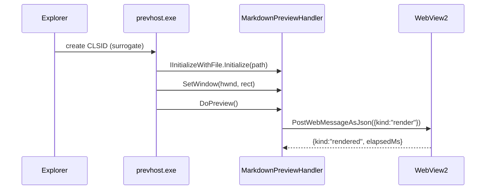
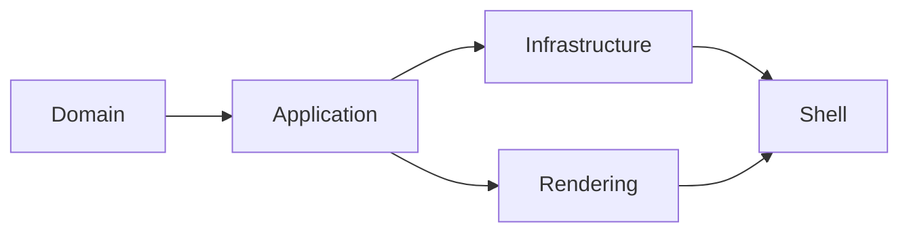

# Kitchen sink

Everything the previewer is supposed to handle, in one file. If any section below
looks wrong in the Explorer preview pane, that is the bug.

## Inline formatting

**Bold**, *italic*, ***both***, `inline code`, ~~strikethrough~~, and a
[link to example.com](https://example.com) that should open in the browser rather
than navigating the pane.

An autolinked bare URL: https://learn.microsoft.com/windows/win32/shell/preview-handlers

## Lists

1. Ordered
2. Items
   1. Nested
   2. Deeper

- Unordered
- Items
  - Nested

## Task lists

- [x] Rendered as a checked, disabled checkbox
- [ ] Rendered as an unchecked, disabled checkbox
- [ ] Loose list item, which markdown-it wraps in a `<p>`

  Second paragraph inside the item.

## Tables

| Component | Version  | Licence      |
| --------- | -------- | ------------ |
| markdown-it | 14.3.0 | MIT          |
| highlight.js | 11.11.1 | BSD-3-Clause |
| Mermaid   | 11.16.0  | MIT          |
| MathJax   | 3.2.2    | Apache-2.0   |

## Code, with highlighting

```csharp
[ComVisible(true)]
[Guid("5B54A6AB-8765-4A71-8732-EA187093A239")]
public sealed class MarkdownPreviewHandler : IPreviewHandler
{
    public int DoPreview()
    {
        // Must not block: rendering needs the message pump.
        _ = RenderAsync(_activeReader);
        return HResult.Ok;
    }
}
```

```powershell
Get-Process prevhost -ErrorAction SilentlyContinue | Stop-Process -Force
```

```
An unlabelled fence. Short ones get language auto-detection; long ones do not,
because auto-detection is O(languages x length).
```

## Mermaid





## Math

Display math:

$$
\int_{0}^{\infty} e^{-x^{2}} \, dx = \frac{\sqrt{\pi}}{2}
$$

Escaped-paren inline math: \( a^2 + b^2 = c^2 \).

Prices, which must **not** be treated as math by default:
this costs $5 and that costs $10.

## Blockquotes

> A preview handler's native failure mode is total silence: no error, no event log
> entry, just an empty pane.
>
> — the reason `Test-MarkdownPreviewHandler.ps1` exists

## Images

A relative image, resolved through the `doc.mdpreview.invalid` virtual host:


A deliberately broken path, which should render as a dashed placeholder rather
than a 0x0 box:


## Horizontal rule

---

## Heading anchors

Links to headings should work: [back to the top](#kitchen-sink), and
[to the math section](#math).
